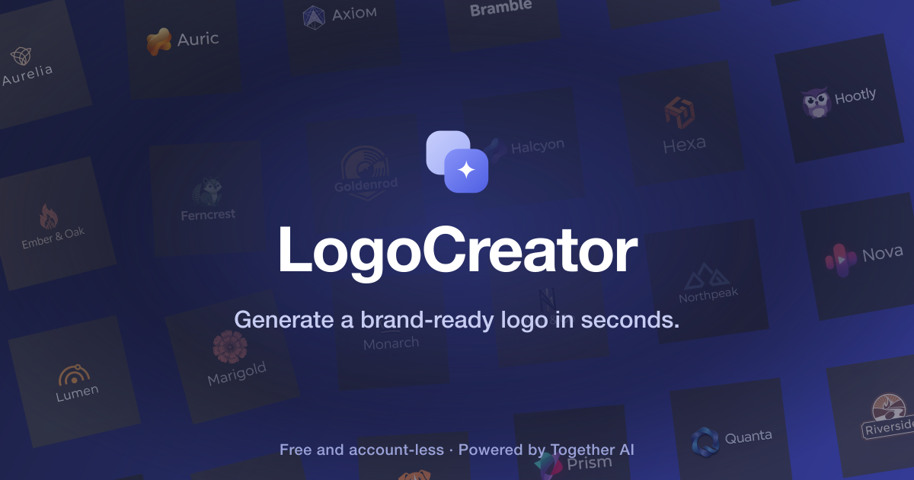

<a href="https://www.logo-creator.io">
  
  <h1 align="center">LogoCreator</h1>
</a>

  An open source AI logo generator: design a brand-ready logo in seconds, then export a full brand kit. Free and account-less.

## Tech stack

- [FLUX.2 pro](https://togetherai.link/flux-playground) on [Together AI](https://togetherai.link/) for generation, with FLUX.1 Kontext for edits
- [Next.js](https://nextjs.org/) (App Router) with TypeScript for the app framework
- [Radix](https://www.radix-ui.com/) primitives and [Tailwind](https://tailwindcss.com/) for the UI
- [Upstash Redis](https://upstash.com/) for optional rate limiting and [Clerk](https://clerk.com/) for optional auth
- [Helicone](https://helicone.ai/) for optional observability

## Cloning and running

1. Clone the repo: `git clone https://github.com/Nutlope/logocreator`
2. Create a `.env.local` file and add your [Together AI API key](https://api.together.xyz/settings/api-keys): `TOGETHER_API_KEY=`
3. Run `npm install` and `npm run dev` to install dependencies and run locally.

Clerk and Upstash are optional: without them, the app runs account-less with a bring-your-own-key flow.

## Future Tasks

- [x] Create a dashboard with a user's logo history
- [x] Support SVG exports instead of just PNG
- [x] Add support for additional styles
- [ ] Add a dropdown for image size (can do up to 1440x1440)
- [x] Show approximate price when using your own Together AI key
- [x] Allow the ability to upload a reference logo (use vision model to read it)
- [x] Redesign popular brand's logos with my logo maker and have it in a showcase
